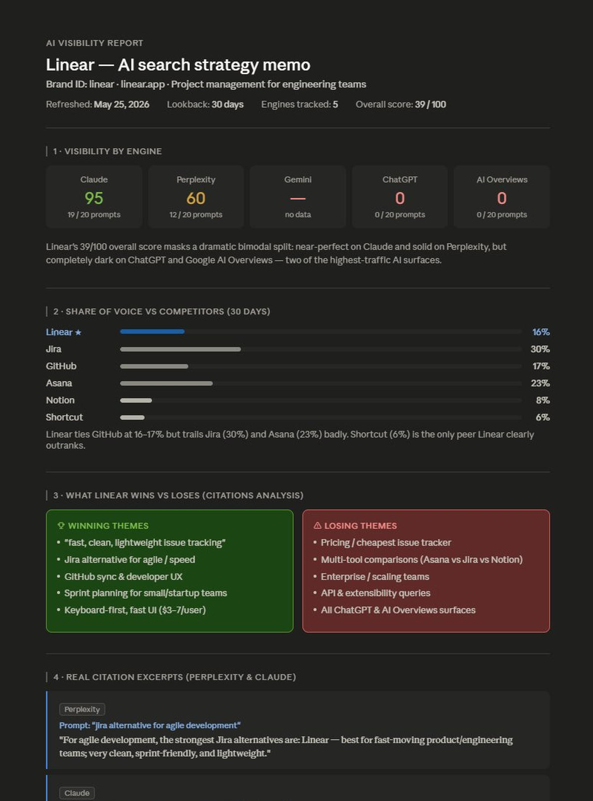
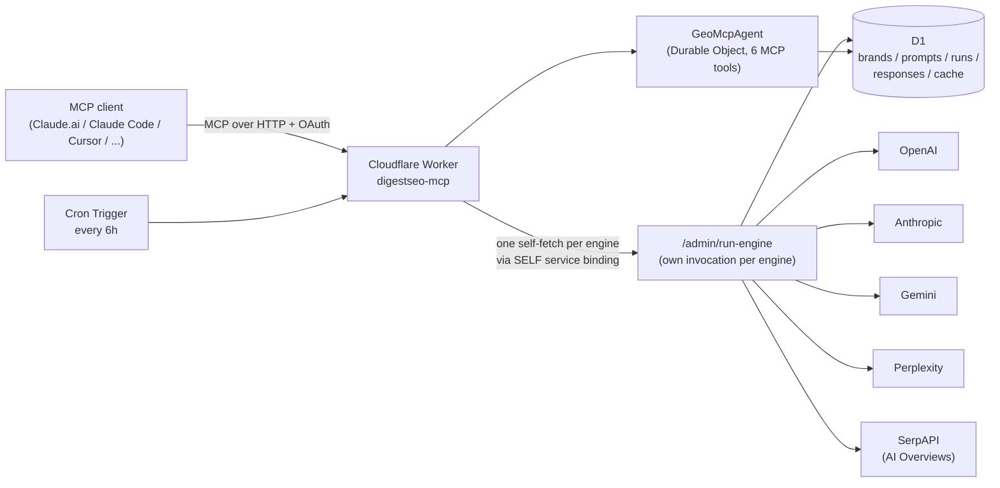

# DigestSEO — AI Visibility MCP for SEO & GEO

[](https://github.com/AKzar1el/mcp-geo/actions/workflows/ci.yml)
[](https://www.npmjs.com/package/@digestseo/mcp-geo)
[](https://registry.modelcontextprotocol.io/v0.1/servers?search=io.github.AKzar1el/mcp-geo)
[](./LICENSE)
[](https://www.typescriptlang.org/)
[](https://workers.cloudflare.com/)
[](https://modelcontextprotocol.io/)
[](https://github.com/AKzar1el/mcp-geo/stargazers)

[](https://glama.ai/mcp/servers/AKzar1el/mcp-geo)
[](https://smithery.ai/servers/digestseo/geo-mcp)

## Quick Install

Runs locally over stdio with your own API keys — all data stays on your machine (see [Privacy Policy](#privacy-policy)). Set at least one engine key (`OPENAI_API_KEY`, `ANTHROPIC_API_KEY`, `GEMINI_API_KEY`, `PERPLEXITY_API_KEY`, `SERPAPI_API_KEY`); engines without a key skip gracefully.

**Claude Desktop / any MCP client (npx):**

```json
{
  "mcpServers": {
    "digestseo": {
      "command": "npx",
      "args": ["-y", "@digestseo/mcp-geo"],
      "env": {
        "OPENAI_API_KEY": "sk-...",
        "GEMINI_API_KEY": "your_key_here"
      }
    }
  }
}
```

**Claude Code:**

```bash
claude mcp add --transport stdio digestseo -s user --env GEMINI_API_KEY=your_key_here -- npx -y @digestseo/mcp-geo
```

**Cursor:**

[](https://cursor.com/en/install-mcp?name=digestseo&config=eyJjb21tYW5kIjoibnB4IiwiYXJncyI6WyIteSIsIkBkaWdlc3RzZW8vbWNwLWdlbyJdLCJlbnYiOnsiT1BFTkFJX0FQSV9LRVkiOiIiLCJBTlRIUk9QSUNfQVBJX0tFWSI6IiIsIkdFTUlOSV9BUElfS0VZIjoiIiwiUEVSUExFWElUWV9BUElfS0VZIjoiIiwiU0VSUEFQSV9BUElfS0VZIjoiIn19)

**Claude Desktop extension (one-click):** download the `.mcpb` bundle from the [latest release](https://github.com/AKzar1el/mcp-geo/releases/latest) and double-click it — Claude Desktop prompts for the API keys.

**First run:** ask your client to *"track acme.com as brand `acme`, then refresh it"* — `track_brand` creates the brand with generated prompts, `refresh_brand` runs the first scan, `check_visibility` shows the scores.

AI agents installing this server: follow [llms-install.md](./llms-install.md). Prefer a remote server with cron auto-refresh? Self-host on Cloudflare Workers below.

---

**mcp-geo** is an open-source **AI visibility tracker** that measures how often your brand is cited by ChatGPT, Claude, Perplexity, Gemini, and Google AI Overviews. It's the **GEO** (Generative Engine Optimization) and **AEO** (Answer Engine Optimization) equivalent of Google Search Console — built as an MCP server so you can query your AI visibility data directly inside Claude.ai, Claude Desktop, Claude Code, Cursor, Codex CLI, or any MCP-compatible client.

Canonical product page: [DigestSEO mcp-geo — AI Visibility MCP Server](https://digestseo.com/geo-mcp/)

> **Prefer zero setup?** Try the hosted version at [digestseo.com](https://digestseo.com) — managed Cloudflare infra, no API keys to manage, multi-brand, scheduled refresh, web UI. Waitlist now open. [Join waitlist →](https://digestseo.com/#waitlist)

---

## What it produces

Connect via MCP, ask Claude *"Run an AI visibility analysis on [my brand]"*, and within 90 seconds you get a strategist-quality memo grounded in real per-engine data:

[](docs/demo-report-full.png)

*[View the full report including content gaps, engine recommendations, and synthesis →](docs/demo-report-full.png)*

The report above was generated by Claude through the digestseo-mcp MCP server. The conversation chained five hosted tools — `visibility.check`, `visibility.compare`, `visibility.citations` (Perplexity + Claude), and `visibility.content_gaps` — to produce a 4-engine analysis with citation excerpts and a 3-recommendation strategy memo.

---

## What's New

### [0.3.0] — July 2026

- **Local stdio CLI on npm** (`npx -y @digestseo/mcp-geo`): the same MCP tools backed by a local SQLite database (`~/.digestseo/digestseo.sqlite`) — no Cloudflare account needed. Engines run inline with your own API keys.
- **Local brand-management tools** (CLI only): `track_brand`, `list_brands`, `generate_prompts`. Workers deployments keep these behind the `X-Seed-Secret`-gated `/admin/*` routes.
- **Runtime-agnostic core** (`src/core/`) shared by the Worker and the CLI, with a `Db` contract implemented by D1 and better-sqlite3 adapters. All 0.2.1 accuracy and security fixes carry over to both runtimes.
- **Distribution metadata**: official MCP Registry `server.json`, MCPB desktop extension (`.mcpb` bundle), Dockerfile, `llms-install.md` for AI agents, release-publish workflow.

### [0.2.1] — June 2026

- **Optional `CONNECT_SECRET` gate on the OAuth flow.** By default the OSS build auto-completes `/authorize` for any MCP client that knows your worker URL — anyone who finds the URL can connect and call `visibility.refresh`, spending your engine API credits. Set `CONNECT_SECRET` and the browser step of the connect flow now asks for it before issuing a token. See [SECURITY.md](./SECURITY.md).
- **Accurate citation matching.** Brand/competitor mentions now require word boundaries (`acme` no longer matches "acmeshop"), and linked-citation checks require the exact domain or a subdomain (`notacme.com` no longer counts as a link to `acme.com`).
- **Per-brand `aliases` and `exclude_terms`.** Aliases always count as a mention; exclude terms suppress the bare-word match on the brand name and domain root — so "Monday" the brand stops matching "monday" the weekday, while `monday.com` still counts. Apply `migrations/0005_brand_alias_exclude.sql`; existing brands behave exactly as before.
- **`visibility.history` consistency.** Partially-finished runs now count toward history (matching `visibility.check`'s 0.2.0 behavior), and fully-failed runs no longer show up as fake zero scores.
- **CI + unit tests.** GitHub Actions runs `tsc --noEmit` plus a pure-function unit suite (`npm run test:unit`) covering mention matching, citation extraction, and score aggregation on every push.
- **Docs now recommend OpenAI + Anthropic as the starting engine pair** — the Gemini free tier rate-limits brands with more than ~5 prompts and produced misleading first-run data as the documented cheapest path.
- Constant-time comparison for `SEED_SECRET` / `CONNECT_SECRET`.

### [0.2.0] — May 2026

- **Per-engine HTTP fan-out.** `/admin/run-live` now creates one runs row per engine and self-fetches `/admin/run-engine` once per engine. Each engine runs in its own worker invocation with its own free-plan 50-subrequest budget — a single-invocation fan-out used to burst past the cap mid-run and lose half the rows.
- **Service binding (`env.SELF`)** dispatches the per-engine fan-out through Cloudflare's internal fabric instead of a public-URL fetch, dodging the "Worker called itself" guard (error 1042) that silently blocks the latter.
- **Status column** on `prompt_responses` (`ok` / `failed` / `skipped`) plus `error_message`. Failed engine calls used to write `raw_response='ERROR: ...'` rows that downstream scoring treated as real zero-mention hits; now they're explicitly excluded.
- **FK-resistant inserts.** `/admin/run-engine` `INSERT OR IGNORE`s its runs row before persisting — D1 is eventually consistent across edge regions, and the upstream `INSERT INTO runs` from `/admin/run-live` doesn't always replicate before the downstream engine call lands. The IGNORE makes the FK happy either way.
- **Bulk D1 batch.** Each engine collects its 20 prompt results in memory then flushes inserts + cache writes + the final `UPDATE runs SET status='completed'` in a single `D1.batch()` call. Drops the per-invocation subrequest count from ~89 to ~26.
- **Relaxed visibility queries.** `getLatestCompletedRun` anchors on `EXISTS(ok rows)` instead of `status='completed'`, so partially-finished runs still surface their data in MCP tool output instead of silently disappearing.
- **New admin route `POST /admin/cleanup-failed-runs`** for one-shot deletion of legacy polluted rows after migrating to 0004.

### [0.1.1] — May 2026

- Manual install is now the canonical path. The unreliable bash setup script was removed; SETUP.md is self-contained and copy-pasteable, with every interactive wrangler prompt documented inline.

### [0.1.0] — May 2026

- Initial public release.
- 5-engine support: ChatGPT (`gpt-4o-mini`), Claude (`claude-haiku-4-5`), Perplexity (`sonar`), Gemini (`gemini-2.5-flash-lite`), and Google AI Overviews (via SerpAPI).
- 6 hosted MCP tools: `visibility.check`, `visibility.history`, `visibility.compare`, `visibility.citations`, `visibility.content_gaps`, `visibility.refresh`.
- Engines are opt-in based on which API keys you provide — set only the credentials you have, the rest skip gracefully.
- Cloudflare Cron Trigger that auto-refreshes tracked brands every 6h, respecting per-brand `refresh_frequency` (daily/weekly).
- D1-backed storage for brands, prompts, runs, citations, and a shared prompt cache.

---

## What Can This Do?

- **See which AI tools cite your brand and which don't** — get a per-engine breakdown of who's citing you for buyer-intent queries.
- **Track AI visibility weekly, automatically** — the built-in Cron Trigger re-runs scans on the cadence you configure per brand.
- **Compare your AI visibility to competitors** — share-of-voice percentages, prompts you win, prompts they win.
- **Find content gaps** — Claude-Haiku-synthesized recommendations grounded in your actual losing prompts.
- **Use it inside Claude.ai conversations** — add the deployed Worker URL as a custom MCP connector and ask in natural language.
- **Self-hosted on your own Cloudflare account** — your API keys, your data, your cost ceiling. The free Workers + D1 tiers cover a single brand with daily refreshes.

*See [the example report above](#what-it-produces) for what this looks like in practice.*

---

## Available Tools

| Tool | What it does | What you provide |
|---|---|---|
| `visibility.check` | Latest AI visibility snapshot across all configured engines for a tracked brand, with per-engine scores, winning prompts, and losing prompts. | `brand_id`, optional `engines[]` filter |
| `visibility.history` | Time-series history of overall and per-engine visibility, bucketed daily or weekly. | `brand_id`, optional `days` (default 30), optional `granularity` (`daily`/`weekly`) |
| `visibility.compare` | Share-of-voice comparison against competitor domains, with prompts you win and prompts they win. | `brand_id`, optional `competitor_domains[]`, optional `days` |
| `visibility.citations` | The actual citation events — prompt, engine, response excerpt, citation type, brand URL when present. | `brand_id`, optional `days`, optional `engine` filter |
| `visibility.content_gaps` | Prioritized Claude-Haiku-generated content recommendations targeting your losing prompts. | `brand_id`, optional `max_recommendations` (1-10) |
| `visibility.refresh` | Manually trigger a fresh scan across every engine whose API key is set. | `brand_id`, optional `engines[]` filter |

The local stdio CLI (npx, desktop extension, Docker) additionally provides brand management — on a Workers deployment the same operations live behind the `X-Seed-Secret`-gated `/admin/*` routes instead:

| Tool (local CLI only) | What it does | What you provide |
|---|---|---|
| `track_brand` | Start tracking a brand: creates it locally and generates its buyer-intent prompt set (Claude Haiku when `ANTHROPIC_API_KEY` is set, three starter prompts otherwise). | `brand_id`, `name`, `domain`, optional `category`, `competitors[]`, `aliases[]`, `exclude_terms[]`, `prompt_count` |
| `list_brands` | List tracked brands with domains, competitors, and active prompt counts. | — |
| `generate_prompts` | Regenerate a brand's prompt set via Claude Haiku (replaces active prompts, keeps history). | `brand_id`, optional `count` (default 20) |

---

## Getting Started

### Step 1 — Get API keys

Engines are opt-in. Pick the ones you want; the rest skip silently.

- **OpenAI** — ChatGPT engine. ~€0.0004 per prompt with `gpt-4o-mini`. Batch path roughly halves that. [platform.openai.com](https://platform.openai.com/api-keys)
- **Anthropic** — Claude engine, plus prompt generation and content-gap analysis (both call Claude Haiku). ~€0.0002 per prompt. Free trial credits are usually enough to evaluate. [console.anthropic.com](https://console.anthropic.com/)
- **Google AI Studio (Gemini)** — Gemini engine. ~€0.0001 per prompt. The free tier has a low per-minute cap, so brands with more than ~5 prompts hit HTTP 429 and drop out of scoring (see [Troubleshooting](#troubleshooting)) — treat it as an opt-in add-on, not a starting engine. [aistudio.google.com](https://aistudio.google.com/app/apikey)
- **Perplexity** — Perplexity Sonar engine. ~€0.005-0.008 per prompt. Paid only. [perplexity.ai/settings/api](https://www.perplexity.ai/settings/api)
- **SerpAPI** — Google AI Overviews engine. ~€0.005 (free tier) / ~€0.0015 (volume) per prompt. Free tier covers ~100 calls/month — enough for development. [serpapi.com/dashboard](https://serpapi.com/dashboard)

**Recommended starting pair: OpenAI + Anthropic (Claude).** Both bill per token with no rate-limit surprises, so your first scan returns clean, scorable data across the ChatGPT and Claude engines — and the Anthropic key also powers prompt generation and content-gap analysis. Solo evaluation runs comfortably under €1/month on the two together. Add Gemini, Perplexity, or SerpAPI deliberately once you want more coverage; Gemini's free tier rate-limits and Google AI Overviews often returns no result (scored as a zero), so leading with the cheapest path can skew your first run.

### Step 2 — Deploy to your Cloudflare account

The deploy is 6 commands and takes about 5 minutes. See [SETUP.md](./SETUP.md) for the full walkthrough with explanations and troubleshooting, or follow the quick version below.

```bash
# 1. Install deps
npm install

# 2. Log in to Cloudflare
npx wrangler login

# 3. Copy the config template
cp wrangler.example.jsonc wrangler.jsonc

# 4. Create KV namespace + D1 database, paste each printed id into wrangler.jsonc
npx wrangler kv namespace create OAUTH_KV
npx wrangler d1 create mcp-geo-db

# 5. Set the required secret + at least one engine API key
#    Recommended starting pair — both bill per token, clean first-run data:
npx wrangler secret put SEED_SECRET
npx wrangler secret put CONNECT_SECRET      # recommended — gates who can connect (see SECURITY.md)
npx wrangler secret put OPENAI_API_KEY      # ChatGPT engine
npx wrangler secret put ANTHROPIC_API_KEY   # Claude engine + prompt generation

# 6. Apply migrations and deploy
npx wrangler d1 migrations apply mcp-geo-db --remote
npx wrangler deploy
```

The production MCP endpoint is the product-based custom domain:

```
https://geo-mcp.digestseo.com/mcp
```

Use that exact URL when publishing `digestseo/mcp-geo` on Smithery.ai.
The endpoint is OAuth-protected, so Smithery will complete its normal MCP
authorization flow during inspection.

### Step 3 — Connect to your MCP client

After `wrangler deploy` finishes, you get a URL like
`https://digestseo-mcp.YOUR-SUBDOMAIN.workers.dev`.

#### Claude.ai (web)

Settings → Connectors → Add custom connector. Paste:

```
https://YOUR-WORKER-NAME.YOUR-SUBDOMAIN.workers.dev/mcp
```

Complete the OAuth handshake. The connector turns green when ready.

#### Claude Code

```bash
claude mcp add --transport http digestseo https://YOUR-WORKER-NAME.YOUR-SUBDOMAIN.workers.dev/mcp
```

Then run `/mcp` inside Claude Code to complete the OAuth handshake in your browser.

#### Claude Desktop

Edit your Claude Desktop config:

- macOS: `~/Library/Application Support/Claude/claude_desktop_config.json`
- Windows: `%APPDATA%\Claude\claude_desktop_config.json`

```jsonc
{
  "mcpServers": {
    "digestseo": {
      "command": "npx",
      "args": [
        "-y",
        "mcp-remote",
        "https://YOUR-WORKER-NAME.YOUR-SUBDOMAIN.workers.dev/mcp"
      ]
    }
  }
}
```

Restart Claude Desktop after editing.

#### Cursor

Edit `~/.cursor/mcp.json`:

```jsonc
{
  "mcpServers": {
    "digestseo": {
      "command": "npx",
      "args": [
        "-y",
        "mcp-remote",
        "https://YOUR-WORKER-NAME.YOUR-SUBDOMAIN.workers.dev/mcp"
      ]
    }
  }
}
```

Restart Cursor.

#### Codex CLI

Add to `~/.codex/config.toml`:

```toml
[mcp_servers.digestseo]
command = "npx"
args = [
  "-y",
  "mcp-remote",
  "https://YOUR-WORKER-NAME.YOUR-SUBDOMAIN.workers.dev/mcp",
]
```

---

## Environment Variables Reference

| Variable | Required | Default | Description |
|---|---|---|---|
| `OPENAI_API_KEY` | opt-in | unset | Enables the ChatGPT engine. Without it, ChatGPT is skipped. |
| `ANTHROPIC_API_KEY` | opt-in | unset | Enables the Claude engine *and* the Claude-Haiku-powered prompt generator + content-gap analyzer. |
| `GEMINI_API_KEY` | opt-in | unset | Enables the Gemini engine. Free tier is rate-limited for brands with more than ~5 prompts (see Troubleshooting); opt-in add-on. |
| `PERPLEXITY_API_KEY` | opt-in | unset | Enables the Perplexity Sonar engine. Paid only. |
| `SERPAPI_API_KEY` | opt-in | unset | Enables the Google AI Overviews engine (via SerpAPI). |
| `SEED_SECRET` | **yes** | unset | Shared secret that gates every `/admin/*` route. Pick a high-entropy string. |
| `CONNECT_SECRET` | recommended | unset | When set, the OAuth connect flow asks for this secret in the browser before issuing a token. Without it, anyone who knows your worker URL can connect an MCP client. See [SECURITY.md](./SECURITY.md). |
| `TURNSTILE_SITE_KEY` | no | unset | Reserved for forks that add a public `/check` form. Unused by the OSS build. |
| `TURNSTILE_SECRET_KEY` | no | unset | Same — reserved for forks. |

All values are set via `wrangler secret put VAR` in production or `.dev.vars` locally. None are stored in `wrangler.jsonc`.

---

## Architecture



Each engine runs in its own Worker invocation with its own free-plan 50-subrequest budget; results are flushed in a single `D1.batch()` per engine. The whole system fits the Cloudflare free tier for a single brand on a daily cadence.

---

## Security

- `/admin/*` is gated by `SEED_SECRET` (constant-time compared).
- `/mcp` requires OAuth; set `CONNECT_SECRET` so only people with the secret can complete the connect flow — strongly recommended whenever your worker URL is shared anywhere, since connected clients can call `visibility.refresh` and spend your engine API credits.
- All engine keys live in Cloudflare's encrypted secret store; all data stays in your own D1 database.

Full details and vulnerability reporting: [SECURITY.md](./SECURITY.md).

---

## Sample Prompts

*The [example report above](#what-it-produces) was generated by the first prompt below.*

Once the connector is live in Claude.ai (or any MCP client), try:

| Tool | Example prompt |
|---|---|
| `visibility.check` | "How visible is brand_id `acme` on AI right now?" |
| `visibility.history` | "Show me the visibility trend for `acme` over the last 60 days, daily." |
| `visibility.compare` | "Compare `acme` against asana.com and monday.com over the last 14 days." |
| `visibility.citations` | "Show me real Perplexity citations for `acme` from the last week." |
| `visibility.content_gaps` | "What content should `acme` publish to close its visibility gap? Give me the top 5." |
| `visibility.refresh` | "Refresh `acme` across every available engine right now." |
| `visibility.refresh` | "Refresh `acme` but only for Gemini and Claude." |

---

## Hosted Version

If you'd rather not run your own Cloudflare account, manage API keys, or pay individual engine bills, the hosted version of DigestSEO runs the same MCP server on managed infrastructure with multi-brand support, scheduled refresh, a web UI, and consolidated billing. Waitlist now open — [join at digestseo.com](https://digestseo.com/#waitlist).

---

## Troubleshooting

- **Worker deploys but tools return empty data** — at least one engine API key is missing. Check `wrangler secret list` and add the keys you intend to use. Engines without keys are silently skipped, which can leave `visibility.check` with no data.
- **`no engines available` error in logs** — no engine API keys are set at all. Set at least one of `OPENAI_API_KEY`, `ANTHROPIC_API_KEY`, `GEMINI_API_KEY`, `PERPLEXITY_API_KEY`, `SERPAPI_API_KEY`.
- **D1 migration fails** — make sure you've run `npx wrangler d1 migrations apply mcp-geo-db --remote` (and also `--local` for `wrangler dev`). For ad-hoc fixes, `npx wrangler d1 execute mcp-geo-db --remote --file=migrations/0001_initial.sql`.
- **Custom MCP connector in Claude.ai not connecting** — the URL must end in `/mcp`. The OAuth handshake auto-completes in the OSS build (single dev user); if you set `CONNECT_SECRET`, the browser step shows a one-field form — enter the secret you set during deploy. If it loops, clear the connector and re-add it. Double-check the Worker is publicly reachable (`curl https://YOUR-WORKER-NAME.YOUR-SUBDOMAIN.workers.dev/healthz` should return `ok`).
- **Cron not firing** — check the Cloudflare dashboard at **Workers & Pages → digestseo-mcp → Settings → Triggers**. The "Cron Triggers" section should list `0 */6 * * *`. If it's missing, run `npx wrangler deploy` again — the trigger is registered on deploy. The handler also only dispatches engines for brands whose `refresh_frequency` cadence has elapsed, so a freshly-seeded brand might not fire on the next 6h boundary.
- **`401 unauthorized` from `/admin/*`** — `X-Seed-Secret` header is missing or doesn't match the deployed `SEED_SECRET`. Re-run `npx wrangler secret put SEED_SECRET` and update your `.env.test`.
- **Worker returns 404 on self-fetch / error code 1042** — the `services` binding in `wrangler.jsonc` is missing or the `service` name doesn't match the worker's `name` field. `/admin/run-live` self-fetches `/admin/run-engine` via `env.SELF` (a Cloudflare service binding) precisely because a public-URL fetch back to your own `workers.dev` hostname is blocked by Cloudflare's "Worker called itself" guard. Confirm the `wrangler.jsonc` you deployed contains `"services": [{ "binding": "SELF", "service": "<your-worker-name>" }]` with the same name you set in the top-level `"name"` field. After fixing, `npx wrangler deploy` and re-run.
- **Gemini rate limit (HTTP 429) on every prompt** — the Gemini free tier caps `gemini-2.5-flash-lite` at single-digit requests per minute and a low daily total. For brands with more than ~5 prompts you'll see `status='failed'` rows with 429 error messages, which excludes Gemini from scoring. Workarounds: upgrade to paid Gemini, switch the `MODEL` constant in `src/core/gemini.ts` to a different model with a higher quota, or invoke `/admin/run-engine` for one engine at a time so the per-minute window has time to refill between batches.
- **`FOREIGN KEY constraint failed` in wrangler tail during `/admin/run-engine`** — D1's cross-region replication hasn't caught up with the `INSERT INTO runs` that `/admin/run-live` just performed. The handler `INSERT OR IGNORE`s the runs row locally to dodge this, so you should not see this on the 0.2.0+ build; if you do, confirm you've deployed the latest `src/index.ts` (`grep -n "INSERT OR IGNORE INTO runs" src/index.ts` should match).

---

## Contributing

Issues and PRs welcome. See [CONTRIBUTING.md](./CONTRIBUTING.md) for the short version.

---

## Privacy Policy

When you run `digestseo-mcp` locally (npx, the desktop extension, or Docker), all of your data — brands, prompts, runs, responses, and the response cache — stays on your machine in a local SQLite database at `~/.digestseo/digestseo.sqlite` (override with `DIGESTSEO_DB_PATH`). The scan prompts are sent to whichever AI providers you configured with your own API keys (OpenAI, Anthropic, Google, Perplexity, and/or SerpAPI), and only to those; their handling of that traffic is governed by their respective privacy policies. Nothing is ever sent to the author of this project: no telemetry, no analytics, no account.

---

## License

[MIT](./LICENSE).

Built and maintained by [Tomi Šeregi](https://tomiseregi.si).

---

## Changelog

See [CHANGELOG.md](./CHANGELOG.md) for the full version history.

### [0.3.0] — July 2026

- Local stdio CLI on npm (`npx -y @digestseo/mcp-geo`) with SQLite storage and inline engine runs.
- Local brand-management tools: `track_brand`, `list_brands`, `generate_prompts`.
- Runtime-agnostic core shared by Worker and CLI; D1 + better-sqlite3 `Db` adapters.
- MCP Registry `server.json`, MCPB desktop extension, Dockerfile, `llms-install.md`.

### [0.2.1] — June 2026

- Optional `CONNECT_SECRET` gate on the OAuth connect flow.
- Word-boundary brand/competitor matching; exact-domain-or-subdomain linked-citation checks.
- Per-brand `aliases` and `exclude_terms` (migration 0005) for homograph brands like Monday/Notion.
- `visibility.history` includes partial runs and drops fully-failed runs.
- CI workflow (typecheck + unit tests) and a pure-function unit test suite.
- Docs recommend OpenAI + Anthropic as the starting engine pair.
- Constant-time secret comparison.

### [0.2.0] — May 2026

- Per-engine HTTP fan-out via `env.SELF` service binding (one worker invocation per engine, dodges Cloudflare's 1042 self-call guard).
- `status` + `error_message` columns on `prompt_responses` — failed engine calls are now explicit rows, no more `ERROR:` strings in `raw_response`.
- `INSERT OR IGNORE` on the runs row inside `/admin/run-engine` (handles D1 cross-region replication lag without dropping prompt_responses to FK violations).
- Bulk D1 batch in each engine's `runLive` (~26 subrequests/invocation instead of ~89; full 20-prompt runs now fit under the free-plan cap).
- `getLatestCompletedRun` anchored on `EXISTS(ok rows)`; partially-finished runs still show their data.
- New `POST /admin/cleanup-failed-runs` admin route.

### [0.1.1] — May 2026

- Removed the unreliable bash setup script. Manual install via SETUP.md is now the canonical path.

### [0.1.0] — May 2026

- Initial public release.
- 5-engine support: ChatGPT, Claude, Perplexity, Gemini, Google AI Overviews.
- 6 MCP tools.
- Engines opt-in based on which API keys you provide.
- Cloudflare Cron Trigger for auto-refresh.
