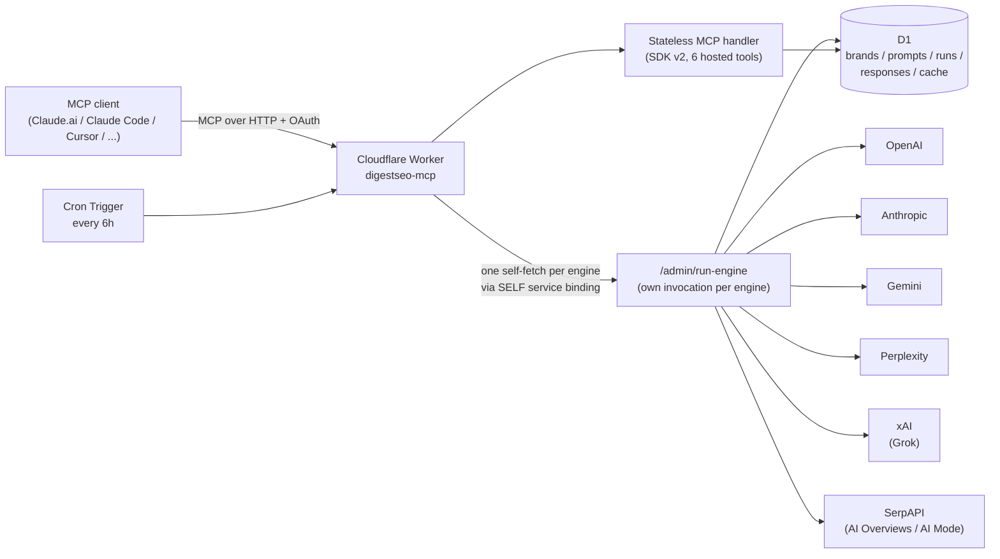

# DigestSEO — AI Visibility MCP for SEO & GEO

[](https://github.com/AKzar1el/mcp-geo/actions/workflows/ci.yml)
[](https://www.npmjs.com/package/@digestseo/mcp-geo)
[](https://registry.modelcontextprotocol.io/v0.1/servers?search=io.github.AKzar1el/mcp-geo)
[](./LICENSE)
[](https://www.typescriptlang.org/)
[](https://workers.cloudflare.com/)
[](https://modelcontextprotocol.io/)
[](https://glama.ai/mcp/servers/AKzar1el/mcp-geo)
[](https://wellknown.network/agents/geo-tracker-by-digestseo)
[](https://github.com/AKzar1el/mcp-geo/stargazers)
[](https://geo-mcp.digestseo.com/audit)


## Quick Install

Runs locally over stdio with your own API keys — all data stays on your machine (see [Privacy Policy](#privacy-policy)). Set at least one engine key (`OPENAI_API_KEY`, `ANTHROPIC_API_KEY`, `GEMINI_API_KEY`, `PERPLEXITY_API_KEY`, `XAI_API_KEY`, `SERPAPI_API_KEY`); engines without a key skip gracefully.

**Runtime:** Node.js 22.13+ (CI exercises Node 22 and 24).

**Claude Desktop / any MCP client (npx):**

```json
{
  "mcpServers": {
    "digestseo": {
      "command": "npx",
      "args": ["-y", "@digestseo/mcp-geo"],
      "env": {
        "OPENAI_API_KEY": "sk-...",
        "GEMINI_API_KEY": "your_key_here"
      }
    }
  }
}
```

**ChatGPT (remote MCP):** ChatGPT does not connect directly to local STDIO MCP servers. For ChatGPT, use the [self-hosted remote MCP setup](#chatgpt-remote-mcp) below, or the [OpenAI Secure MCP Tunnel setup](#chatgpt-localprivate-via-openai-secure-mcp-tunnel) for a server running on a local/private machine. The public `geo-mcp.digestseo.com/mcp` endpoint is not a turnkey no-key fresh-scan service.

**Perplexity Computer (remote MCP):** Perplexity Computer supports custom remote MCP connectors on eligible plans. After self-hosting mcp-geo, open **Account settings > Connectors > + Custom connector**, choose **Remote**, name it `digestseo`, and enter your own deployment's `https://<worker-host>/mcp` URL. Use the connector's OAuth option for the Worker flow; if you configured `CONNECT_SECRET`, complete that browser gate during connection. Do not use the public `geo-mcp.digestseo.com/mcp` endpoint as a turnkey no-key scan service. See Perplexity's current [Computer connector guidance](https://www.perplexity.ai/changelog/what-we-shipped---march-13-2026).

**Replit Agent (remote MCP):** after self-hosting mcp-geo, open **Integrations -> MCP Servers for Replit Agent -> Add MCP server**, name it `digestseo`, and enter your own deployment's `https://<worker-host>/mcp` URL. Choose the OAuth flow when prompted: Replit supports OAuth dynamic client registration (DCR), which the self-hosted Worker exposes through its standard discovery and registration endpoints. Select **Test & Save**, then complete the browser authorization step; if you configured `CONNECT_SECRET`, enter it in that gate. Replit supports remote HTTPS MCP servers rather than this package's local stdio process, so use your configured Worker URL and do not treat the public `geo-mcp.digestseo.com/mcp` endpoint as a turnkey provider-key service. See Replit's current [MCP guide](https://docs.replit.com/features/mcp/overview).

**Claude Code:**

```bash
claude mcp add --transport stdio digestseo -s user --env GEMINI_API_KEY=your_key_here -- npx -y @digestseo/mcp-geo
```

Or install the same local MCP integration through this repository's owner-controlled Claude Code marketplace:

```text
/plugin marketplace add AKzar1el/mcp-geo
/plugin install digestseo-geo@digestseo-mcp
```

The marketplace plugin uses the repository's `.mcp.json` to launch `npx -y @digestseo/mcp-geo`. Zero provider keys are enough for tool discovery; for engine-backed scans, make only the provider keys you want available to the Claude Code process. The direct `claude mcp add` command above remains the simplest option when you want to attach provider keys explicitly to the server configuration.

**Codex CLI:**

```bash
codex mcp add digestseo -- npx -y @digestseo/mcp-geo
```

The zero-key command is enough for tool discovery. Add only the provider keys you want with repeated `--env NAME=VALUE` options before the `--` when engine-backed scans are needed.

**Amp CLI:**

```bash
amp mcp add digestseo -- npx -y @digestseo/mcp-geo
```

Amp runs this as a local STDIO MCP server. The zero-key command is enough for tool discovery; before engine-backed scans, make only the provider keys you want available to the Amp process or configure them in Amp's local MCP `env` settings instead of committing secrets. See Amp's current [MCP guide](https://ampcode.com/docs/customize/mcp).

**OpenCode v2:**

```bash
opencode mcp add digestseo --global -- npx -y @digestseo/mcp-geo
```

OpenCode v2 runs this as a local STDIO server. Omit `--global` for project-only configuration. Zero keys are enough for MCP tool discovery. For engine-backed scans, edit the generated OpenCode v2 config and add only the provider variables you want under `mcp.servers.digestseo.environment`, mapping each to an environment reference such as `"OPENAI_API_KEY": "{env:OPENAI_API_KEY}"`; keep the actual secret value in the process environment rather than in the config file. Verify the connection with `opencode mcp list`. See the current [OpenCode v2 MCP guide](https://opencode.ai/v2/docs/mcp-servers).

**Mistral Vibe Code:** add mcp-geo to the user-level `~/.vibe/config.toml` or project-level `./.vibe/config.toml`:

```toml
[[mcp_servers]]
name = "digestseo"
transport = "stdio"
command = "npx"
args = ["-y", "@digestseo/mcp-geo"]
```

The zero-key entry is enough for tool discovery. For engine-backed scans, pass only the provider keys you want through Vibe's STDIO environment configuration or the environment inherited by Vibe instead of committing secrets. Use `/mcp digestseo` (or `/mcp`) in Vibe to verify the server and tools. See Mistral's current [MCP server guide](https://docs.mistral.ai/vibe/code/cli/mcp-servers) and [Vibe configuration reference](https://docs.mistral.ai/vibe/code/cli/configuration).

**LibreChat:** add mcp-geo to `librechat.yaml` as a local STDIO server:

```yaml
mcpServers:
  digestseo:
    type: stdio
    command: npx
    args:
      - -y
      - '@digestseo/mcp-geo'
```

Restart LibreChat after changing `librechat.yaml`. The zero-key entry is enough for MCP tool discovery. Before engine-backed scans, expose only the provider API keys you intend to use to the LibreChat process rather than committing secret values into the YAML file. See LibreChat's current [MCP configuration guide](https://www.librechat.ai/docs/configuration/librechat_yaml/object_structure/mcp_servers) and [MCP feature guide](https://www.librechat.ai/docs/features/mcp).

**AnythingLLM:** add mcp-geo from **Settings -> Agent Configuration -> MCP**, or merge this entry into `anythingllm_mcp_servers.json` in AnythingLLM's storage `plugins` directory:

```json
{
  "mcpServers": {
    "digestseo": {
      "command": "npx",
      "args": ["-y", "@digestseo/mcp-geo"]
    }
  }
}
```

AnythingLLM treats command-backed servers as local STDIO MCP servers and can start them when an agent needs their tools. The zero-key entry is enough for MCP discovery; before engine-backed scans, add only the provider environment variables you intend to use through AnythingLLM's MCP configuration or the process environment instead of committing raw secrets. See AnythingLLM's current [MCP compatibility guide](https://docs.anythingllm.com/mcp-compatibility/overview).

**Langflow:** open **Settings -> MCP Servers** (or the MCP sidebar -> **Add MCP Server**), choose **STDIO**, name the server `digestseo`, set Command to `npx`, and add Arguments `-y` and `@digestseo/mcp-geo`. The zero-key server is enough for MCP tool discovery; before engine-backed scans, add only the provider keys you intend to use in Langflow's MCP **Environment Variables** fields rather than storing raw secrets in a flow. Then select the saved server from an **MCP Tools** component and connect its tools to a Langflow Agent. If Langflow itself runs in Docker, its image must include Node.js before it can launch an `npx` server. See Langflow's current [MCP client guide](https://docs.langflow.org/mcp-client).

**Cherry Studio:** open **Settings -> MCP -> MCP Servers -> Add**, choose **STDIO**, name the server `digestseo`, set Command to `npx`, and add Arguments `-y` and `@digestseo/mcp-geo`. The zero-key server is enough for MCP tool discovery. Before engine-backed scans, add only the provider keys you intend to use in Cherry Studio's MCP environment-variable fields rather than putting secrets in prompts or screenshots. Enable the server, inspect its **Tools**, then bind it to the intended Agent under **Work -> Agent -> Edit -> MCP**. See Cherry Studio's current official [MCP configuration guide](https://github.com/CherryHQ/cherry-studio-docs/blob/main/i18n/english/advanced-basic/mcp/config.md) and [MCP workflow guide](https://github.com/CherryHQ/cherry-studio-docs/blob/main/advanced-basic/extensions/mcp/README.md).

**Raycast AI:** open **Install MCP Server** (or **Manage MCP Servers -> Install New Server**), choose **Standard Input/Output**, set Command to `npx`, and set Arguments to `-y` and `@digestseo/mcp-geo`. The zero-key install is enough for tool discovery. Before engine-backed scans, add only the provider keys you want in Raycast's MCP **Environment** fields rather than hard-coding them into shared project files. Restart Raycast if `npx` was added to `PATH` after Raycast started. See Raycast's current [MCP manual](https://manual.raycast.com/ai/model-context-protocol).

**Msty Studio:** open **Toolbox -> Add New Tool**, choose **STDIO / JSON**, and use:

```json
{
  "command": "npx",
  "args": ["-y", "@digestseo/mcp-geo"]
}
```

The zero-key tool is enough for MCP discovery. For engine-backed scans, define only the provider keys you want in Msty Studio **Environments** and attach them to the tool rather than storing raw secrets in shared files. Msty Studio Desktop can run the tool locally; Studio Web needs its documented Desktop/Sidecar connection for local MCP tools. See Msty Studio's current [Toolbox MCP guide](https://docs.msty.ai/studio/toolbox/tools) and [environment guide](https://docs.msty.ai/studio/workspaces/environment).

**Jan Desktop / Jan Agent:** in Jan Desktop open **Settings -> MCP Servers -> + Add MCP Server**, choose **STDIO**, set Command to `npx`, and add Args `-y` and `@digestseo/mcp-geo`. The zero-key server is enough for tool discovery; add only the provider keys you intend to use through Jan's MCP **Env** fields. Jan Agent reads the same MCP configuration, or you can add it from the terminal with `jan cli mcp add digestseo --command npx --arg -y --arg @digestseo/mcp-geo` and then enable it. If you run **Path B** on your own Worker, Jan also supports **HTTP** MCP servers at `https://<worker-host>/mcp` and handles advertised OAuth with metadata discovery, dynamic client registration, and authorization-code + PKCE. Do not present the public DigestSEO endpoint as a turnkey provider-key service. See Jan's current [MCP server guide](https://www.jan.ai/docs/desktop/integrations/mcp-servers) and [Agent MCP guide](https://www.jan.ai/docs/agent/mcp).

**Zed:** open **Settings -> AI -> MCP Servers**, choose **Add Server -> Add Local Server**, and configure `digestseo` with command `npx` and arguments `-y`, `@digestseo/mcp-geo`. The zero-key local server is enough for tool discovery; for engine-backed scans, add only the provider keys you intend to use in Zed's local MCP `env` map rather than committing secrets into shared project settings. If you run **Path B** on your own Worker instead, choose **Add Remote Server** and use `https://<worker-host>/mcp`; when no `Authorization` header is configured, Zed uses the standard MCP OAuth flow. Do not treat the public DigestSEO endpoint as a turnkey provider-key service. See Zed's current [MCP guide](https://zed.dev/docs/ai/mcp).

**TraeCode:** open **Settings -> MCP -> Add -> Manually add** and paste this local STDIO configuration, or save the same `mcpServers` object as `.trae/mcp.json` in a trusted project:

```json
{
  "mcpServers": {
    "digestseo": {
      "command": "npx",
      "args": ["-y", "@digestseo/mcp-geo"]
    }
  }
}
```

TraeCode recommends NPX/UVX for local MCP servers and supports `env` values when engine-backed scans need provider keys. The zero-key form is enough for discovery; keep raw provider secrets out of project-level `.trae/mcp.json`. TraeCode CLI can also load that project-level MCP file, or you can add an equivalent `stdio` entry through `traecli config edit` and inspect it with `/mcp`. See TraeCode's current [IDE MCP setup](https://docs.trae.cn/ide_add-mcp-servers) and [CLI MCP guide](https://docs.trae.cn/cli_model-context-protocol).

**GitHub Copilot CLI:**

```bash
copilot mcp add digestseo -- npx -y @digestseo/mcp-geo
```

The base install starts with zero provider keys so tool discovery works. Add only the engine keys you want with Copilot CLI's `--env NAME=VALUE` option before running scans.

**Portable Agent Plugin (GitHub Copilot / VS Code / Kiro and other Agent Plugins 1.0 clients):** this repository now ships the standard root `plugin.json` + `mcp.json` pair. GitHub Copilot CLI can install it directly from GitHub:

```bash
copilot plugin install AKzar1el/mcp-geo
```

In VS Code, run **Chat: Install Plugin from Source** and enter `https://github.com/AKzar1el/mcp-geo`. In Kiro, use **Powers -> Add Custom Power -> Import power from GitHub** with the same repository URL. The portable plugin launches `npx -y @digestseo/mcp-geo`; zero provider keys are enough for discovery, while engine-backed scans inherit only the provider keys you intentionally make available to the host client. Existing native install paths above remain valid.

**Qoder CLI:**

```bash
qoder mcp add digestseo -- npx -y @digestseo/mcp-geo
qoder mcp list
```

Qoder launches this as a local STDIO MCP server. The zero-key command is enough for tool discovery; make only the provider keys you want available to the Qoder process before engine-backed scans. If Qoder is already running, use `/mcp reload` to rediscover the server and tools. See Qoder's current [MCP server guide](https://docs.qoder.com/cli/mcp-servers) and [MCP reference](https://docs.qoder.com/cli/mcp-reference).

**Docker Agent:** Docker Agent can launch local STDIO MCP servers directly from agent YAML. Add this toolset to the agent that should use mcp-geo:

```yaml
toolsets:
  - type: mcp
    command: npx
    args: ["-y", "@digestseo/mcp-geo"]
```

The zero-key form is enough for tool discovery. For engine-backed scans, add only the provider keys you need under the toolset's `env:` map (Docker Agent supports `${env.NAME}` expansion) instead of committing secret values. See Docker's current [local MCP tool documentation](https://docs.docker.com/ai/docker-agent/tools/mcp/).

**goose:** add mcp-geo as a local STDIO extension in `~/.config/goose/config.yaml` (macOS/Linux) or `%APPDATA%\Block\goose\config\config.yaml` (Windows):

```yaml
extensions:
  digestseo-geo:
    type: stdio
    name: digestseo-geo
    enabled: true
    cmd: npx
    args: ["-y", "@digestseo/mcp-geo"]
    timeout: 300
```

The zero-key extension is enough for tool discovery. Before engine-backed scans, configure only the provider environment variables you want for this extension through goose's extension settings / secret storage instead of putting raw API keys in the YAML file. The same server can also be added interactively with `goose configure` -> **Add Extension** -> **Command-Line Extension**. See goose's current [extension setup](https://block.github.io/goose/docs/getting-started/using-extensions/) and [configuration reference](https://block.github.io/goose/docs/guides/config-files/).

**GitLab Duo CLI:** current GitLab Duo CLI releases can consume Claude-compatible plugin marketplaces directly. Register this repository and install the existing `digestseo-geo` plugin:

```bash
glab duo plugin marketplace add https://github.com/AKzar1el/mcp-geo.git
glab duo plugin install digestseo-geo@digestseo-mcp
```

The installed plugin loads the same local `npx -y @digestseo/mcp-geo` MCP server from `.mcp.json`. Zero provider keys allow discovery; make only the provider keys you want available to the GitLab Duo CLI process before engine-backed scans.

**Factory Droid:**

```bash
droid mcp add digestseo "npx -y @digestseo/mcp-geo"
droid mcp list
```

Droid runs this as a local STDIO MCP server. The zero-key install is enough for tool discovery; add only the provider keys you choose in Droid's user-level MCP configuration before engine-backed scans. Keep provider secrets out of project-level `.factory/mcp.json` files.

**Amazon Q Developer (IDE):** open the Q Developer chat panel ? **Tools** ? **+**, choose **STDIO**, name the server `digestseo`, set Command to `npx`, and add Arguments `-y` and `@digestseo/mcp-geo`. Add only the provider environment variables you want before running scans; zero keys still allow MCP tool discovery.

**Amazon Q Developer CLI:** add the same local STDIO server through Q's native MCP manager:

```bash
q mcp add --name digestseo --command npx --args '["-y", "@digestseo/mcp-geo"]'
q mcp list
```

The zero-key server is enough for MCP tool discovery. Before engine-backed scans, add only the provider variables you intend to use to the Q CLI MCP configuration instead of committing secrets to the repository. Amazon Q Developer CLI supports local process-backed MCP servers and manages them through `q mcp`; use `/tools` inside a Q session to inspect the tools that loaded. See AWS's current [Amazon Q Developer MCP guide](https://docs.aws.amazon.com/amazonq/latest/qdeveloper-ug/qdev-mcp.html) and [CLI MCP configuration reference](https://docs.aws.amazon.com/amazonq/latest/qdeveloper-ug/command-line-mcp-config-CLI.html).

**JetBrains AI Assistant (IDE):** open **Settings > Tools > AI Assistant > Model Context Protocol (MCP) > Add**, choose **STDIO**, and use:

```json
{
  "mcpServers": {
    "digestseo": {
      "command": "npx",
      "args": ["-y", "@digestseo/mcp-geo"]
    }
  }
}
```

JetBrains AI Assistant supports local STDIO and NPX MCP servers. The zero-key form is enough for tool discovery; before engine-backed scans, make only the provider keys you want available to the IDE process, or import an already-configured Claude MCP server.

**JetBrains Air:** this repository already ships the standard root `.mcp.json` that launches `npx -y @digestseo/mcp-geo`. In Air, open **Settings > AI > MCP Servers**, enable **MCP support** and **Launch workspace MCP servers**, then use the **Workspace** scope so Air reuses that checked-in file. The repository config contains no provider secrets and is sufficient for zero-key tool discovery. Engine-backed scans still require the selected provider keys in the local server process environment; keep them out of committed `.mcp.json`. See the [JetBrains Air MCP server guide](https://www.jetbrains.com/help/air/mcp-servers.html).

**Visual Studio 2022 17.14+ / Visual Studio 2026:** Visual Studio uses its own `servers`-shaped MCP configuration. Create `%USERPROFILE%\.mcp.json` for a user-wide install or `<SOLUTIONDIR>\.mcp.json` for one solution:

```json
{
  "servers": {
    "digestseo": {
      "type": "stdio",
      "command": "npx",
      "args": ["-y", "@digestseo/mcp-geo"]
    }
  }
}
```

Open GitHub Copilot Chat in **Agent** mode and use the **Tools** menu to verify `digestseo` is available. Zero provider keys are enough for tool discovery; before engine-backed scans, make only the provider keys you want available to the Visual Studio process rather than committing secrets into the solution file. See Microsoft's current [Visual Studio MCP setup](https://learn.microsoft.com/azure/developer/azure-mcp-server/get-started/tools/visual-studio).

**Cursor:**

[](https://cursor.com/en/install-mcp?name=digestseo&config=eyJjb21tYW5kIjoibnB4IiwiYXJncyI6WyIteSIsIkBkaWdlc3RzZW8vbWNwLWdlbyJdLCJlbnYiOnsiT1BFTkFJX0FQSV9LRVkiOiIiLCJBTlRIUk9QSUNfQVBJX0tFWSI6IiIsIkdFTUlOSV9BUElfS0VZIjoiIiwiUEVSUExFWElUWV9BUElfS0VZIjoiIiwiU0VSUEFQSV9BUElfS0VZIjoiIn19)

**Windsurf:** open **Manage MCPs → View raw config** and add the local stdio package:

```json
{
  "mcpServers": {
    "digestseo": {
      "command": "npx",
      "args": ["-y", "@digestseo/mcp-geo"],
      "env": {
        "OPENAI_API_KEY": "sk-..."
      }
    }
  }
}
```

Use only the provider keys you want; zero keys still allow MCP tool discovery.

**Roo Code:** open **MCP Servers > Edit Global MCP**, or create `.roo/mcp.json` for a project-scoped install, and add:

```json
{
  "mcpServers": {
    "digestseo": {
      "command": "npx",
      "args": ["-y", "@digestseo/mcp-geo"]
    }
  }
}
```

Roo Code supports local STDIO MCP servers. The zero-key form is enough for tool discovery; add only the provider keys you want before scans. On Windows, if Roo cannot launch `npx` directly, use `"command": "cmd"` with `"args": ["/c", "npx", "-y", "@digestseo/mcp-geo"]`, matching Roo's documented Windows fallback.

**VS Code:** [Install the local stdio server in VS Code](vscode:mcp/install?%7B%22name%22%3A%22digestseo%22%2C%22command%22%3A%22npx%22%2C%22args%22%3A%5B%22-y%22%2C%22%40digestseo%2Fmcp-geo%22%5D%7D). The base install starts with no provider keys so tool discovery works; add only the API keys you want in your VS Code MCP user configuration before running scans.

**LM Studio:** [Add the local stdio server to LM Studio](https://lmstudio.ai/install-mcp?name=digestseo&config=eyJjb21tYW5kIjoibnB4IiwiYXJncyI6WyIteSIsIkBkaWdlc3RzZW8vbWNwLWdlbyJdfQ%3D%3D). The base install starts with no provider keys so tool discovery works; add only the API keys you want in LM Studio's `mcp.json` before running scans.

**Kiro:** [](https://kiro.dev/launch/mcp/add?name=digestseo&config=%7B%22command%22%3A%22npx%22%2C%22args%22%3A%5B%22-y%22%2C%22%40digestseo%2Fmcp-geo%22%5D%7D) for a one-click local install, or open the user MCP config (`~/.kiro/settings/mcp.json`) / workspace config (`.kiro/settings/mcp.json`) and add the local stdio package manually:

```json
{
  "mcpServers": {
    "digestseo": {
      "command": "npx",
      "args": ["-y", "@digestseo/mcp-geo"]
    }
  }
}
```

Kiro supports local STDIO MCP servers across its current surfaces. The zero-key form is enough for discovery; add only the provider environment variables you want before engine-backed scans. For remote use, self-host the Worker below and configure your own deployed `/mcp` URL instead. The public `geo-mcp.digestseo.com/mcp` endpoint is not a turnkey no-key fresh-scan service.

**Claude Desktop extension (one-click):** download the `.mcpb` bundle from the [latest release](https://github.com/AKzar1el/mcp-geo/releases/latest) and double-click it — Claude Desktop prompts for the API keys.

**First run:** ask your client to *"track acme.com as brand `acme`, then refresh it"* — `track_brand` creates the brand with generated prompts, `refresh_brand` runs the first scan, `check_visibility` shows the scores.

AI agents installing this server: follow [llms-install.md](https://github.com/AKzar1el/mcp-geo/blob/main/llms-install.md). Prefer a remote server with cron auto-refresh? Self-host on Cloudflare Workers below.

---

**mcp-geo** is an open-source **AI visibility tracker** that measures how often your brand is cited by ChatGPT, Claude, Perplexity, Gemini, Grok, Google AI Overviews, and Google AI Mode. It's the **GEO** (Generative Engine Optimization) and **AEO** (Answer Engine Optimization) equivalent of Google Search Console — built as an MCP server so you can query your AI visibility data directly inside ChatGPT through a configured remote MCP app, Claude.ai, Claude Desktop, Claude Code, GitHub Copilot CLI, Cursor, Codex CLI, or any MCP-compatible client.

Canonical product page: [DigestSEO mcp-geo — AI Visibility MCP Server](https://digestseo.com/geo-mcp/)

Engineering case study: [DigestSEO MCP Suite — AI visibility, Search Console, web validation, and trend intelligence](https://tomiseregi.si/projects/digestseo-mcp-suite)

> **Need a client-ready baseline without running the stack yourself?** The [mcp-geo AI Visibility Audit](https://geo-mcp.digestseo.com/audit) is EUR 99 one time: one brand, up to three competitors, 20 buyer-intent prompts, checks across up to five supported AI surfaces where configured providers return usable results, citation evidence, and a prioritized action memo. The open-source package remains free.
>
> **See proof first:** [Open the sample report](https://github.com/AKzar1el/mcp-geo/blob/main/docs/demo-report-full.png) generated through mcp-geo to see the output style and evidence depth before requesting the audit.
>
> **Ready to request it?** [Open a prefilled email](mailto:info@tomiseregi.si?subject=mcp-geo%20AI%20Visibility%20Audit%20-%20EUR%2099&body=Hi%20Tomi%2C%0A%0AI%27d%20like%20the%20EUR%2099%20mcp-geo%20AI%20Visibility%20Audit.%0A%0ABrand%2Fdomain%3A%0ACompetitors%20%28up%20to%203%29%3A%0AContext%20or%20priority%20%28optional%29%3A%0A%0ASource%3A%20mcp-geo%20README) with your brand/domain and up to three competitors. No subscription or sales call is required.
>
> **Payment handoff:** After fit and scope are confirmed, I reply with the normal invoice/payment instructions.
>
> **Methodology:** The same 20 buyer-intent prompts are run as a point-in-time diagnostic and reported per engine, with citation/source evidence where available. The audit is an observed snapshot, not a proprietary ranking promise or guaranteed forecast.
>
> **Want the protocol before buying?** [Read the AI Visibility Audit methodology](https://github.com/AKzar1el/mcp-geo/blob/main/docs/ai-visibility-audit-methodology.md), including scope, engine coverage, interpretation limits, and what the audit does not claim.

> **Prefer zero setup?** Try the hosted version at [digestseo.com](https://digestseo.com) — managed Cloudflare infra, no API keys to manage, multi-brand, scheduled refresh, web UI. Waitlist now open. [Join waitlist →](https://digestseo.com/#waitlist)

---

## What it produces

Connect via MCP, ask Claude *"Run an AI visibility analysis on [my brand]"*, and within 90 seconds you get a strategist-quality memo grounded in real per-engine data:

[](https://github.com/AKzar1el/mcp-geo/blob/main/docs/demo-report-full.png)

*[View the full report including content gaps, engine recommendations, and synthesis →](https://github.com/AKzar1el/mcp-geo/blob/main/docs/demo-report-full.png)*

Want to reproduce the same evidence-first structure with your own data? Use the [reusable AI Visibility Audit report prompt](https://github.com/AKzar1el/mcp-geo/blob/main/docs/ai-visibility-audit-report-prompt.md).

The report above was generated by Claude through the digestseo-mcp MCP server. The conversation chained five hosted tools — `visibility.check`, `visibility.compare`, `visibility.citations` (Perplexity + Claude), and `visibility.content_gaps` — to produce a 4-engine analysis with citation excerpts and a 3-recommendation strategy memo.

---

## What's New

### [0.3.24] - September 23, 2026

- **Source-domain intelligence:** `get_citations` / `visibility.citations` now summarizes the most frequently cited engine-native source domains across the requested window, with prompt counts, contributing engines, representative URLs, and tracked-brand-domain flags.
- **Clear hosted MCP identity:** modern SDK-v2 discovery now exposes the human-readable GEO Tracker title, concise description, and canonical product URL without changing the stateless transport contract.
- **More native client onboarding:** Replit Agent remote-MCP and Jan Desktop / Jan Agent setup now reuse the existing local or self-hosted mcp-geo paths without introducing another package or hosted turnkey-provider claim.

### [0.3.23] - September 23, 2026

- **Current Grok model:** grounded Grok visibility scans now use xAI's current `grok-4.7` model while preserving the existing Responses API, required Web Search grounding, and BYOK flow.
- **AnythingLLM onboarding:** MCP Management / `anythingllm_mcp_servers.json` setup now covers the published local stdio package with zero-key discovery and secret-safe optional provider configuration.
- **Accurate Perplexity guidance:** setup text now matches the already-shipped Agent API `fast` preset and points to live pricing instead of stale Sonar/fixed per-prompt wording.

### [0.3.22] - September 23, 2026

- **Perplexity retirement-safe:** Perplexity scans now use the Agent API `fast` preset instead of the retiring fixed Sonar model selector, preserving grounded web-search visibility after the September 27 Sonar retirement.
- **Current plugin discovery truth:** portable Agent Plugin and Claude marketplace metadata now include Google AI Mode alongside the other supported AI-search surfaces.
- **Amazon Q Developer CLI:** native `q mcp` onboarding now covers the existing local stdio package with zero-key discovery and secret-safe provider configuration.
- **Accurate self-hosting guidance:** setup documentation now reflects the stateless SDK-v2 hosted MCP path and current manual-refresh scheduling behavior.

### [0.3.21] - September 22, 2026

- **Stateless hosted MCP:** OAuth-protected `/mcp` traffic now uses Cloudflare's SDK-v2 `createMcpHandler` path with legacy stateless compatibility and explicit Host/Origin validation, while the old Durable Object binding remains only as a conservative migration hold.
- **Leaner tool context:** all twelve MCP tools now expose concise example-led descriptions and complete input-parameter guidance, reducing client context overhead and making tool selection clearer.

### [0.3.20] - September 22, 2026

- **Bounded provider requests:** external AI-provider and SerpAPI calls now time out after 90 seconds instead of allowing a stalled upstream API to hang a scan indefinitely.
- **Durable manual Worker scans:** authenticated `/admin/run-live` requests can set `wait_for_completion: true` so manual/operator refreshes remain attached until service-binding engine work finishes.

### [0.3.19] - September 22, 2026

- **Google AI Mode:** opt in with `SERPAPI_AI_MODE_ENABLED=true` to measure Google AI Mode separately through SerpAPI, including citation/source evidence when returned.
- **Safe tracked-brand corrections:** local MCP users can call `update_brand` to change identity, competitors, aliases, exclusions, or refresh cadence without replacing prompts or historical runs.
- **Manual scheduling:** set `refresh_frequency` to `manual` to pause self-hosted scheduled scans while keeping explicit `refresh_brand` available.

### [0.3.18] - September 21, 2026

- **Grok visibility coverage:** opt in with XAI_API_KEY to measure grounded Grok answers via xAI Web Search alongside ChatGPT, Claude, Perplexity, Gemini, and Google AI Overviews.

### [0.3.17] - September 21, 2026

- **Exact user-defined measurement sets:** local MCP users can now call `set_prompts` to replace a brand's active prompts with 1-50 agreed buyer questions while preserving historical runs; repeated identical sets are a no-op.

### [0.3.16] - September 21, 2026

- **New-project Gemini compatibility:** Gemini scans now default to `gemini-3.1-flash-lite`, avoiding the Gemini 2.5 access restriction Google applies to some new projects while preserving the same GenerateContent integration.

### [0.3.15] - September 20, 2026

- **Clearer provider setup failures:** an explicit refresh request for an unconfigured engine now names the unavailable engine and explains how to recover instead of reporting that no engines at all are available.
- **Broader local-client onboarding:** copy-paste setup now covers Roo Code, Codex CLI, and OpenCode v2 in addition to the existing MCP clients.
- **Reliable installed README links:** npm-package readers are routed to durable GitHub URLs for documentation and report assets that are intentionally excluded from the tarball.

### [0.3.14] - September 20, 2026

- **Inspectable measurement inputs:** local MCP users can now call `list_prompts` to review the exact active buyer-intent prompt set for a tracked brand without regenerating or changing it.
- **Correct ChatGPT onboarding:** ChatGPT guidance now uses a configured remote MCP server or OpenAI Secure MCP Tunnel for local/private servers instead of advertising unsupported direct local STDIO registration.

### [0.3.13] - September 20, 2026

- **More faithful citation evidence:** get_citations now preserves the exact engine-native cited page URL, including path and query, when the provider returns one.
- **Current Gemini CLI gallery metadata:** the extension manifest now stays version-synchronized with the package, preventing stale gallery version labels after release.

### [0.3.12] - September 20, 2026

- **Better agent workflow guidance:** local and hosted MCP initialize responses now include concise server-level instructions for the correct brand → refresh → visibility flow, asynchronous hosted refresh behavior, and unavailable-engine semantics.

### [0.3.11] - September 19, 2026

- **More reliable scheduled tracking:** per-engine freshness and due-engine fan-out keep stale providers updating without needlessly rescanning fresh ones, while brands can choose daily or weekly cadence.
- **Safer request handling:** duplicate engine selections are deduplicated in hosted refresh and visibility reads, and hosted brand seeding rejects invalid refresh cadence values before persistence.
- **Complete Claude Desktop metadata:** the MCPB manifest now declares all nine fixed local tools, including `track_brand`, `list_brands`, and `generate_prompts`, matching the actual stdio server exposed after install.

### [0.3.10] - September 19, 2026

- **Safer BYOK refreshes:** duplicate engine names are deduplicated before provider dispatch so one request cannot accidentally trigger duplicate scans or provider charges.
- **Stronger MCP contracts:** winning/losing prompt and content-gap structured outputs now publish concrete schemas instead of opaque records, improving client-side validation and agent interoperability.
- **Better Registry installs:** Official MCP Registry metadata now advertises all five supported provider API keys as optional secret configuration for the npm stdio package.

### [0.3.9] - September 19, 2026

- **Transparent snapshot freshness:** visibility snapshots now expose each engine's own observation timestamp so older engine data cannot be mistaken for uniformly fresh results.
- **Auditable history trends:** visibility history now includes the usable-prompt denominator, brand-mention count, and observation time behind every per-engine score.

### [0.3.8] - September 19, 2026

- **More reliable audit evidence:** competitor comparisons now honor their requested multi-day window across all usable runs and return exact mention counts; citation excerpts and provider-free content-gap fallbacks are grounded in the same underlying evidence.
- **Broader local install reach:** added Amazon Q Developer IDE setup for the existing local stdio package.

### [0.3.7] - September 19, 2026

- **Exact audit prompt count:** prompt generation now persists exactly the requested number of unique prompts or leaves the existing prompt set untouched, protecting the paid audit's fixed 20-prompt scope.

### [0.3.6] - September 18, 2026

- **Grounded ChatGPT scans:** live ChatGPT visibility uses web search, and domain-lookalike mention scoring was tightened.
- **Broader local install reach:** added Gemini CLI metadata plus one-click VS Code and LM Studio install paths.

### [0.3.5] - September 17, 2026

- **Provider/runtime correctness:** migrated Perplexity to the Agent API and kept plugin installs on the local stdio package rather than the unconfigured public Worker.
- **Trust/readiness:** added owned privacy disclosure, production-only MCPB packaging, and transparent audit score formulas.

### [0.3.4] - September 15, 2026

- **Claude Desktop MCPB portability:** the bundle no longer ships `better-sqlite3` native binaries; local storage uses built-in `node:sqlite` on Node.js 22.13+.
- **Registry accuracy:** official metadata now advertises the npm stdio package only while the public hosted endpoint is not a turnkey configured fresh-scan service.

### [0.3.3] - September 10, 2026

- **Optional one-time audit:** the open-source package stays free; teams that want a client-ready baseline can request the EUR 99 mcp-geo AI Visibility Audit from the CTA above.
- **Lower-friction request path:** the README now opens a prefilled, source-marked email, while the audit details remain available at `https://geo-mcp.digestseo.com/audit`.

### [0.3.2] — July 27, 2026

- **Published scoped package:** `@digestseo/mcp-geo` with synchronized Worker, MCP Registry, and MCPB metadata.
- **Hosted tool metadata:** `visibility.*` namespaces with typed input/output schemas; local stdio tool names remain flat.
- **Distribution and deployment:** dedicated `mcp-geo-db` D1 configuration, Cursor and Claude Code plugin metadata, and patched production dependency pins.

### [0.3.0] — July 2026

- **Local stdio CLI on npm** (`npx -y @digestseo/mcp-geo`): the same MCP tools backed by a local SQLite database (`~/.digestseo/digestseo.sqlite`) — no Cloudflare account needed. Engines run inline with your own API keys.
- **Local brand-management tools** (CLI only): `track_brand`, `list_brands`, `generate_prompts`. Workers deployments keep these behind the `X-Seed-Secret`-gated `/admin/*` routes.
- **Runtime-agnostic core** (`src/core/`) shared by the Worker and the CLI, with a `Db` contract implemented by D1 and better-sqlite3 adapters. All 0.2.1 accuracy and security fixes carry over to both runtimes.
- **Distribution metadata**: official MCP Registry `server.json`, MCPB desktop extension (`.mcpb` bundle), Dockerfile, `llms-install.md` for AI agents, release-publish workflow.

### [0.2.1] — June 2026

- **Optional `CONNECT_SECRET` gate on the OAuth flow.** By default the OSS build auto-completes `/authorize` for any MCP client that knows your worker URL — anyone who finds the URL can connect and call `visibility.refresh`, spending your engine API credits. Set `CONNECT_SECRET` and the browser step of the connect flow now asks for it before issuing a token. See [SECURITY.md](https://github.com/AKzar1el/mcp-geo/blob/main/SECURITY.md).
- **Accurate citation matching.** Brand/competitor mentions now require word boundaries (`acme` no longer matches "acmeshop"), and linked-citation checks require the exact domain or a subdomain (`notacme.com` no longer counts as a link to `acme.com`).
- **Per-brand `aliases` and `exclude_terms`.** Aliases always count as a mention; exclude terms suppress the bare-word match on the brand name and domain root — so "Monday" the brand stops matching "monday" the weekday, while `monday.com` still counts. Apply `migrations/0005_brand_alias_exclude.sql`; existing brands behave exactly as before.
- **`visibility.history` consistency.** Partially-finished runs now count toward history (matching `visibility.check`'s 0.2.0 behavior), and fully-failed runs no longer show up as fake zero scores.
- **CI + unit tests.** GitHub Actions runs `tsc --noEmit` plus a pure-function unit suite (`npm run test:unit`) covering mention matching, citation extraction, and score aggregation on every push.
- **Docs now recommend OpenAI + Anthropic as the starting engine pair** — Gemini capacity varies by model, project, and usage tier, so provider-specific quota variability could produce misleading first-run data as the documented cheapest path.
- Constant-time comparison for `SEED_SECRET` / `CONNECT_SECRET`.

### [0.2.0] — May 2026

- **Per-engine HTTP fan-out.** `/admin/run-live` now creates one runs row per engine and self-fetches `/admin/run-engine` once per engine. Each engine runs in its own worker invocation with its own free-plan 50-subrequest budget — a single-invocation fan-out used to burst past the cap mid-run and lose half the rows.
- **Service binding (`env.SELF`)** dispatches the per-engine fan-out through Cloudflare's internal fabric instead of a public-URL fetch, dodging the "Worker called itself" guard (error 1042) that silently blocks the latter.
- **Status column** on `prompt_responses` (`ok` / `failed` / `skipped`) plus `error_message`. Failed engine calls used to write `raw_response='ERROR: ...'` rows that downstream scoring treated as real zero-mention hits; now they're explicitly excluded.
- **FK-resistant inserts.** `/admin/run-engine` `INSERT OR IGNORE`s its runs row before persisting — D1 is eventually consistent across edge regions, and the upstream `INSERT INTO runs` from `/admin/run-live` doesn't always replicate before the downstream engine call lands. The IGNORE makes the FK happy either way.
- **Bulk D1 batch.** Each engine collects its 20 prompt results in memory then flushes inserts + cache writes + the final `UPDATE runs SET status='completed'` in a single `D1.batch()` call. Drops the per-invocation subrequest count from ~89 to ~26.
- **Relaxed visibility queries.** `getLatestCompletedRun` anchors on `EXISTS(ok rows)` instead of `status='completed'`, so partially-finished runs still surface their data in MCP tool output instead of silently disappearing.
- **New admin route `POST /admin/cleanup-failed-runs`** for one-shot deletion of legacy polluted rows after migrating to 0004.

### [0.1.1] — May 2026

- Manual install is now the canonical path. The unreliable bash setup script was removed; SETUP.md is self-contained and copy-pasteable, with every interactive wrangler prompt documented inline.

### [0.1.0] — May 2026

- Initial public release.
- 5-engine support: ChatGPT (`gpt-4o-mini`), Claude (`claude-haiku-4-5`), Perplexity (`sonar`), Gemini (`gemini-2.5-flash-lite`), and Google AI Overviews (via SerpAPI).
- 6 hosted MCP tools: `visibility.check`, `visibility.history`, `visibility.compare`, `visibility.citations`, `visibility.content_gaps`, `visibility.refresh`.
- Engines are opt-in based on which API keys you provide — set only the credentials you have, the rest skip gracefully.
- Cloudflare Cron Trigger that auto-refreshes tracked brands every 6h, respecting per-brand `refresh_frequency` (daily/weekly).
- D1-backed storage for brands, prompts, runs, citations, and a shared prompt cache.

---

## What Can This Do?

- **See which AI tools cite your brand and which don't** — get a per-engine breakdown of who's citing you for buyer-intent queries.
- **Track AI visibility weekly, automatically** — the built-in Cron Trigger re-runs scans on the cadence you configure per brand.
- **Compare your AI visibility to competitors** — share-of-voice percentages, prompts you win, prompts they win.
- **Find content gaps** — Claude-Haiku-synthesized recommendations grounded in your actual losing prompts.
- **Use it inside Claude.ai conversations** — add the deployed Worker URL as a custom MCP connector and ask in natural language.
- **Self-hosted on your own Cloudflare account** — your API keys, your data, your cost ceiling. The free Workers + D1 tiers cover a single brand with daily refreshes.

*See [the example report above](#what-it-produces) for what this looks like in practice.*

---

## Available Tools

The six analysis capabilities are shared across both transports, but the exposed MCP names are intentionally transport-specific: hosted/Worker connections use the `visibility.*` namespace, while the local stdio package uses flat names.

| Hosted / Worker | Local stdio | What it does | What you provide |
|---|---|---|---|
| `visibility.check` | `check_visibility` | Latest AI visibility snapshot across all configured engines for a tracked brand, with per-engine scores, winning prompts, and losing prompts. | `brand_id`, optional `engines[]` filter |
| `visibility.history` | `get_visibility_history` | Time-series history of overall and per-engine visibility, bucketed daily or weekly. | `brand_id`, optional `days` (default 30), optional `granularity` (`daily`/`weekly`) |
| `visibility.compare` | `compare_competitors` | Share-of-voice comparison against competitor domains, with prompts you win and prompts they win. | `brand_id`, optional `competitor_domains[]`, optional `days` |
| `visibility.citations` | `get_citations` | The actual citation events — prompt, engine, response excerpt, citation type, brand URL when present. | `brand_id`, optional `days`, optional `engine` filter |
| `visibility.content_gaps` | `get_content_gaps` | Prioritized Claude-Haiku-generated content recommendations targeting your losing prompts. | `brand_id`, optional `max_recommendations` (1-10) |
| `visibility.refresh` | `refresh_brand` | Manually trigger a fresh scan across every engine whose API key is set. | `brand_id`, optional `engines[]` filter |

The local stdio CLI (npx, desktop extension, Docker) additionally provides brand management — on a Workers deployment the same operations live behind the `X-Seed-Secret`-gated `/admin/*` routes instead:

| Tool (local CLI only) | What it does | What you provide |
|---|---|---|
| `track_brand` | Start tracking a brand: creates it locally and generates its buyer-intent prompt set (Claude Haiku when `ANTHROPIC_API_KEY` is set, three starter prompts otherwise). | `brand_id`, `name`, `domain`, optional `category`, `competitors[]`, `aliases[]`, `exclude_terms[]`, `prompt_count`, `refresh_frequency` (`daily`/`weekly`/`manual`, default `weekly`) |
| `update_brand` | Correct an existing brand's domain, name, category, competitors, aliases, exclusions, or refresh cadence without replacing active prompts or historical runs. Set cadence to `manual` to pause scheduled Worker scans while keeping manual refresh available. | `brand_id` plus any fields to change |
| `list_brands` | List tracked brands with domains, competitors, aliases, exclusions, and active prompt counts. | — |
| `list_prompts` | Inspect the exact active buyer-intent prompts for a tracked brand without changing them. | `brand_id` |
| `set_prompts` | Replace the active prompt set with exact user-supplied buyer questions while preserving historical runs. | `brand_id`, `prompts[]` (1-50 unique questions) |
| `generate_prompts` | Regenerate a brand's prompt set via Claude Haiku (replaces active prompts, keeps history). | `brand_id`, optional `count` (default 20) |

---

## Getting Started

### Step 1 — Get API keys

Engines are opt-in. Pick the ones you want; the rest skip silently.

- **OpenAI** — ChatGPT engine (`gpt-5-search-api`) with web search. OpenAI currently bills web search at $10 per 1,000 calls plus model token charges; see [API pricing](https://developers.openai.com/api/docs/pricing) and [API keys](https://platform.openai.com/api-keys).
- **Anthropic** — Claude engine, plus prompt generation and content-gap analysis (both call Claude Haiku). ~€0.0002 per prompt. Free trial credits are usually enough to evaluate. [console.anthropic.com](https://console.anthropic.com/)
- **Google AI Studio (Gemini)** — Gemini engine (`gemini-3.1-flash-lite`). Google currently offers free-tier token usage for this model, while paid usage is token-priced. Rate limits vary by model, project, and usage tier, and Google says actual capacity can vary; check your project's active limits in AI Studio rather than relying on a fixed RPM/RPD assumption. See [Gemini pricing](https://ai.google.dev/gemini-api/docs/pricing) and [rate limits](https://ai.google.dev/gemini-api/docs/rate-limits).
- **Perplexity** — Agent API `fast` preset for grounded web-search visibility. Paid API usage; pricing depends on the preset workload, so check current Agent API pricing before estimating scan cost. [Perplexity Agent API](https://docs.perplexity.ai/docs/agent-api/quickstart) · [pricing](https://docs.perplexity.ai/docs/getting-started/pricing)
- **xAI** — Grok engine (`grok-4.7`) with required Web Search grounding. xAI currently prices Web Search at $5 per 1,000 calls plus model tokens. [console.x.ai](https://console.x.ai/) · [pricing](https://docs.x.ai/developers/pricing)
- **SerpAPI** — Google AI Overviews plus optional Google AI Mode. One SerpAPI key powers both, but AI Mode is deliberately off by default because it adds a separate paid search per prompt; set `SERPAPI_AI_MODE_ENABLED=true` when you want that seventh surface. [Google AI Mode API](https://serpapi.com/google-ai-mode-api) · [serpapi.com/dashboard](https://serpapi.com/dashboard)

**Recommended starting pair: OpenAI + Anthropic (Claude).** OpenAI provides grounded ChatGPT visibility through web search and bills search calls plus model tokens; Anthropic also powers prompt generation and content-gap analysis. Review current provider pricing before estimating recurring scan cost. Add Gemini, Perplexity, Grok, or SerpAPI deliberately once you want more coverage; Gemini capacity varies by model, project, and usage tier, and Google AI Overviews often returns no result (scored as a zero). Google AI Mode is a separate SerpAPI call and stays disabled until `SERPAPI_AI_MODE_ENABLED=true`, preventing an existing SerpAPI setup from silently doubling Google search calls.

### Step 2 — Deploy to your Cloudflare account

The deploy is 6 commands and takes about 5 minutes. See [SETUP.md](https://github.com/AKzar1el/mcp-geo/blob/main/SETUP.md) for the full walkthrough with explanations and troubleshooting, or follow the quick version below.

```bash
# 1. Install deps
npm install

# 2. Log in to Cloudflare
npx wrangler login

# 3. Copy the config template
cp wrangler.example.jsonc wrangler.jsonc

# 4. Create KV namespace + D1 database, paste each printed id into wrangler.jsonc
npx wrangler kv namespace create OAUTH_KV
npx wrangler d1 create mcp-geo-db

# 5. Set the required secret + at least one engine API key
#    Recommended starting pair — OpenAI uses web search plus model tokens; check current pricing:
npx wrangler secret put SEED_SECRET
npx wrangler secret put CONNECT_SECRET      # recommended — gates who can connect (see SECURITY.md)
npx wrangler secret put OPENAI_API_KEY      # ChatGPT engine
npx wrangler secret put ANTHROPIC_API_KEY   # Claude engine + prompt generation

# 6. Apply migrations and deploy
npx wrangler d1 migrations apply mcp-geo-db --remote
npx wrangler deploy
```

After deploying your own Worker, use that deployment's `/mcp` URL as the
remote endpoint, for example:

```
https://YOUR-WORKER-NAME.YOUR-SUBDOMAIN.workers.dev/mcp
```

Use your configured Worker URL for directory or client integrations. The
public `geo-mcp.digestseo.com/mcp` endpoint is not a no-key hosted substitute
for a deployment with engine provider credentials.

### Step 3 — Connect to your MCP client

After `wrangler deploy` finishes, you get a URL like
`https://digestseo-mcp.YOUR-SUBDOMAIN.workers.dev`.

#### Claude.ai (web)

Settings → Connectors → Add custom connector. Paste:

```
https://YOUR-WORKER-NAME.YOUR-SUBDOMAIN.workers.dev/mcp
```

Complete the OAuth handshake. The connector turns green when ready.

#### ChatGPT (remote MCP)

ChatGPT custom MCP apps connect to remote MCP servers, so use the `/mcp` URL
from your configured Worker deployment above. In ChatGPT, enable Developer
Mode/custom apps for your workspace and add that remote MCP URL. Availability
depends on your ChatGPT plan and workspace admin policy; OpenAI's current MCP
support does not require special `search` or `fetch` tool names.

```
https://YOUR-WORKER-NAME.YOUR-SUBDOMAIN.workers.dev/mcp
```

#### ChatGPT (local/private via OpenAI Secure MCP Tunnel)

OpenAI Secure MCP Tunnel is the supported bridge when you want ChatGPT to use
the local stdio package without exposing it as a public HTTPS server. Create a
tunnel in OpenAI Platform first, then keep `tunnel-client` running on the same
machine that launches mcp-geo. You need a tunnel ID, a tunnel runtime API key,
and ChatGPT developer-mode/tunnel permissions for the target workspace.

Make whichever provider keys you want to use available to the mcp-geo process,
then initialize a tunnel profile with the local package command:

```text
tunnel-client init --sample sample_mcp_stdio_local --profile digestseo --tunnel-id tunnel_0123456789abcdef0123456789abcdef --mcp-command "npx -y @digestseo/mcp-geo"
tunnel-client doctor --profile digestseo --explain
tunnel-client run --profile digestseo
```

While `tunnel-client run` is healthy, create a developer-mode app in ChatGPT,
choose **Tunnel** as the connection type, and select that tunnel. This path is
for private/local use; it does not publish mcp-geo as a public ChatGPT app.
Follow OpenAI's current [Secure MCP Tunnel guide](https://developers.openai.com/api/docs/guides/secure-mcp-tunnels) for tunnel creation, permissions, downloads, and troubleshooting.

#### Claude Code

```bash
claude mcp add --transport http digestseo https://YOUR-WORKER-NAME.YOUR-SUBDOMAIN.workers.dev/mcp
```

Then run `/mcp` inside Claude Code to complete the OAuth handshake in your browser.

#### Claude Desktop

Edit your Claude Desktop config:

- macOS: `~/Library/Application Support/Claude/claude_desktop_config.json`
- Windows: `%APPDATA%\Claude\claude_desktop_config.json`

```jsonc
{
  "mcpServers": {
    "digestseo": {
      "command": "npx",
      "args": [
        "-y",
        "mcp-remote",
        "https://YOUR-WORKER-NAME.YOUR-SUBDOMAIN.workers.dev/mcp"
      ]
    }
  }
}
```

Restart Claude Desktop after editing.

#### Cursor

Edit `~/.cursor/mcp.json`:

```jsonc
{
  "mcpServers": {
    "digestseo": {
      "command": "npx",
      "args": [
        "-y",
        "mcp-remote",
        "https://YOUR-WORKER-NAME.YOUR-SUBDOMAIN.workers.dev/mcp"
      ]
    }
  }
}
```

Restart Cursor.

#### Codex CLI

Add to `~/.codex/config.toml`:

```toml
[mcp_servers.digestseo]
command = "npx"
args = [
  "-y",
  "mcp-remote",
  "https://YOUR-WORKER-NAME.YOUR-SUBDOMAIN.workers.dev/mcp",
]
```

---

## Environment Variables Reference

| Variable | Required | Default | Description |
|---|---|---|---|
| `OPENAI_API_KEY` | opt-in | unset | Enables the ChatGPT engine. Without it, ChatGPT is skipped. |
| `ANTHROPIC_API_KEY` | opt-in | unset | Enables the Claude engine *and* the Claude-Haiku-powered prompt generator + content-gap analyzer. |
| `GEMINI_API_KEY` | opt-in | unset | Enables the Gemini engine. Rate limits vary by model, project, and usage tier; check the project's active limits in Google AI Studio (see Troubleshooting). |
| `PERPLEXITY_API_KEY` | opt-in | unset | Enables the Perplexity Agent API `fast` preset. Paid API usage; check current Agent API pricing. |
| `XAI_API_KEY` | opt-in | unset | Enables the Grok engine (`grok-4.7`) with required Web Search grounding. |
| `SERPAPI_API_KEY` | opt-in | unset | Enables Google AI Overviews via SerpAPI. Also provides the credential for Google AI Mode when the explicit flag below is enabled. |
| `SERPAPI_AI_MODE_ENABLED` | no | `false` | Set to `true` to add Google AI Mode as a separate visibility engine. It stays off by default to avoid unexpected extra SerpAPI calls/cost. |
| `SEED_SECRET` | **yes** | unset | Shared secret that gates every `/admin/*` route. Pick a high-entropy string. |
| `CONNECT_SECRET` | recommended | unset | When set, the OAuth connect flow asks for this secret in the browser before issuing a token. Without it, anyone who knows your worker URL can connect an MCP client. See [SECURITY.md](https://github.com/AKzar1el/mcp-geo/blob/main/SECURITY.md). |
| `TURNSTILE_SITE_KEY` | no | unset | Reserved for forks that add a public `/check` form. Unused by the OSS build. |
| `TURNSTILE_SECRET_KEY` | no | unset | Same — reserved for forks. |

Provider credentials are set via `wrangler secret put VAR` in production or `.dev.vars` locally. `SERPAPI_AI_MODE_ENABLED` is a non-secret runtime flag and may be stored under Wrangler `vars` or set in the local process environment.

---

## Architecture



The legacy `GeoMcpAgent` / `MCP_OBJECT` Durable Object binding is retained temporarily for migration compatibility, but current `/mcp` traffic is served by the stateless SDK v2 handler shown above.

Each engine runs in its own Worker invocation with its own free-plan 50-subrequest budget; results are flushed in a single `D1.batch()` per engine. The whole system fits the Cloudflare free tier for a single brand on a daily cadence.

---

## Security

- `/admin/*` is gated by `SEED_SECRET` (constant-time compared).
- `/mcp` requires OAuth; set `CONNECT_SECRET` so only people with the secret can complete the connect flow — strongly recommended whenever your worker URL is shared anywhere, since connected clients can call `visibility.refresh` and spend your engine API credits.
- All engine keys live in Cloudflare's encrypted secret store; all data stays in your own D1 database.

Full details and vulnerability reporting: [SECURITY.md](https://github.com/AKzar1el/mcp-geo/blob/main/SECURITY.md).

---

## Sample Prompts

*The [example report above](#what-it-produces) was generated by the first prompt below.*

Once the connector is live in Claude.ai (or any MCP client), try:

| Tool | Example prompt |
|---|---|
| `visibility.check` | "How visible is brand_id `acme` on AI right now?" |
| `visibility.history` | "Show me the visibility trend for `acme` over the last 60 days, daily." |
| `visibility.compare` | "Compare `acme` against asana.com and monday.com over the last 14 days." |
| `visibility.citations` | "Show me real Perplexity citations for `acme` from the last week." |
| `visibility.content_gaps` | "What content should `acme` publish to close its visibility gap? Give me the top 5." |
| `visibility.refresh` | "Refresh `acme` across every available engine right now." |
| `visibility.refresh` | "Refresh `acme` but only for Gemini and Claude." |

---

## Hosted Version

If you'd rather not run your own Cloudflare account, manage API keys, or pay individual engine bills, the hosted version of DigestSEO runs the same MCP server on managed infrastructure with multi-brand support, scheduled refresh, a web UI, and consolidated billing. Waitlist now open — [join at digestseo.com](https://digestseo.com/#waitlist).

---

## Troubleshooting

- **Worker deploys but tools return empty data** — at least one engine API key is missing. Check `wrangler secret list` and add the keys you intend to use. Engines without keys are silently skipped, which can leave `visibility.check` with no data.
- **`no engines available` error in logs** — no engine API keys are set at all. Set at least one of `OPENAI_API_KEY`, `ANTHROPIC_API_KEY`, `GEMINI_API_KEY`, `PERPLEXITY_API_KEY`, `XAI_API_KEY`, `SERPAPI_API_KEY`.
- **D1 migration fails** — make sure you've run `npx wrangler d1 migrations apply mcp-geo-db --remote` (and also `--local` for `wrangler dev`). For ad-hoc fixes, `npx wrangler d1 execute mcp-geo-db --remote --file=migrations/0001_initial.sql`.
- **Custom MCP connector in Claude.ai not connecting** — the URL must end in `/mcp`. The OAuth handshake auto-completes in the OSS build (single dev user); if you set `CONNECT_SECRET`, the browser step shows a one-field form — enter the secret you set during deploy. If it loops, clear the connector and re-add it. Double-check the Worker is publicly reachable (`curl https://YOUR-WORKER-NAME.YOUR-SUBDOMAIN.workers.dev/healthz` should return `ok`).
- **Cron not firing** — check the Cloudflare dashboard at **Workers & Pages → digestseo-mcp → Settings → Triggers**. The "Cron Triggers" section should list `0 */6 * * *`. If it's missing, run `npx wrangler deploy` again — the trigger is registered on deploy. The handler also only dispatches engines for brands whose `refresh_frequency` cadence has elapsed, so a freshly-seeded brand might not fire on the next 6h boundary.
- **`401 unauthorized` from `/admin/*`** — `X-Seed-Secret` header is missing or doesn't match the deployed `SEED_SECRET`. Re-run `npx wrangler secret put SEED_SECRET` and update your `.env.test`.
- **Worker returns 404 on self-fetch / error code 1042** — the `services` binding in `wrangler.jsonc` is missing or the `service` name doesn't match the worker's `name` field. `/admin/run-live` self-fetches `/admin/run-engine` via `env.SELF` (a Cloudflare service binding) precisely because a public-URL fetch back to your own `workers.dev` hostname is blocked by Cloudflare's "Worker called itself" guard. Confirm the `wrangler.jsonc` you deployed contains `"services": [{ "binding": "SELF", "service": "<your-worker-name>" }]` with the same name you set in the top-level `"name"` field. After fixing, `npx wrangler deploy` and re-run.
- **Gemini rate limit (HTTP 429) on prompts** — Gemini API limits vary by model, project, and usage tier, and Google notes that actual capacity can vary. Check the project's current limits in [Google AI Studio](https://aistudio.google.com/) and Google's [rate-limit documentation](https://ai.google.dev/gemini-api/docs/rate-limits). When a request is rate-limited, mcp-geo records that engine row as failed and excludes it from successful scoring. Google recommends waiting and retrying after a short period or reducing request rate; if the limit is consistently too low for your scan cadence, consider an appropriate paid tier rather than assuming a universal free-tier RPM/RPD quota.
- **`FOREIGN KEY constraint failed` in wrangler tail during `/admin/run-engine`** — the handler defensively `INSERT OR IGNORE`s the runs row before persisting prompt responses. This is an idempotency/FK guard for independently dispatched engine work, so you should not see this on the 0.2.0+ build; if you do, confirm you've deployed the latest `src/index.ts` (`grep -n "INSERT OR IGNORE INTO runs" src/index.ts` should match).

---

## Contributing

Issues and PRs welcome. See [CONTRIBUTING.md](https://github.com/AKzar1el/mcp-geo/blob/main/CONTRIBUTING.md) for the short version.

---

## Privacy Policy

Full policy for the local package and Claude Desktop extension: https://geo-mcp.digestseo.com/privacy

When you run `digestseo-mcp` locally (npx, the desktop extension, or Docker), all of your data — brands, prompts, runs, responses, and the response cache — stays on your machine in a local SQLite database at `~/.digestseo/digestseo.sqlite` (override with `DIGESTSEO_DB_PATH`). The scan prompts are sent only to the AI providers whose API keys you configure (OpenAI, Anthropic, Google, Perplexity, xAI, and/or SerpAPI); their handling of that traffic is governed by their respective privacy policies. Nothing is ever sent to the author of this project: no telemetry, no analytics, no account.


**Data use and storage:** Local brand configuration, prompts, scan runs, responses, and cached responses are used only to provide the MCP server features you invoke. They remain in the local SQLite database described above; this project does not operate an account service or collect telemetry.

**Third-party processing:** Prompt and scan traffic is sent only to the AI providers you explicitly configure. Those providers process and retain that traffic under their own privacy policies; the project author does not receive copies of it.

**Retention and deletion:** Local data remains on your machine until you delete the SQLite database (or the custom `DIGESTSEO_DB_PATH` you configured). Removing that local database removes mcp-geo's stored local history and cache. Provider-side retention is controlled by each configured provider.

**Contact:** Privacy questions about mcp-geo can be sent to `info@tomiseregi.si`.

---

## License

[MIT](./LICENSE).

Built and maintained by [Tomi Šeregi](https://tomiseregi.si).

---

## Changelog

See [CHANGELOG.md](https://github.com/AKzar1el/mcp-geo/blob/main/CHANGELOG.md) for the full version history.

### [0.3.2] — July 27, 2026

- Published `@digestseo/mcp-geo` with synchronized Worker, MCP Registry, and MCPB metadata.
- Hosted `visibility.*` tool namespaces with typed input/output schemas; local stdio names remain flat.
- Dedicated `mcp-geo-db` D1 configuration and Cursor/Claude Code plugin metadata.
- Patched production dependency pins.

### [0.3.0] — July 2026

- Local stdio CLI on npm (`npx -y @digestseo/mcp-geo`) with SQLite storage and inline engine runs.
- Local brand-management tools: `track_brand`, `list_brands`, `generate_prompts`.
- Runtime-agnostic core shared by Worker and CLI; D1 + better-sqlite3 `Db` adapters.
- MCP Registry `server.json`, MCPB desktop extension, Dockerfile, `llms-install.md`.

### [0.2.1] — June 2026

- Optional `CONNECT_SECRET` gate on the OAuth connect flow.
- Word-boundary brand/competitor matching; exact-domain-or-subdomain linked-citation checks.
- Per-brand `aliases` and `exclude_terms` (migration 0005) for homograph brands like Monday/Notion.
- `visibility.history` includes partial runs and drops fully-failed runs.
- CI workflow (typecheck + unit tests) and a pure-function unit test suite.
- Docs recommend OpenAI + Anthropic as the starting engine pair.
- Constant-time secret comparison.

### [0.2.0] — May 2026

- Per-engine HTTP fan-out via `env.SELF` service binding (one worker invocation per engine, dodges Cloudflare's 1042 self-call guard).
- `status` + `error_message` columns on `prompt_responses` — failed engine calls are now explicit rows, no more `ERROR:` strings in `raw_response`.
- `INSERT OR IGNORE` on the runs row inside `/admin/run-engine` (handles D1 cross-region replication lag without dropping prompt_responses to FK violations).
- Bulk D1 batch in each engine's `runLive` (~26 subrequests/invocation instead of ~89; full 20-prompt runs now fit under the free-plan cap).
- `getLatestCompletedRun` anchored on `EXISTS(ok rows)`; partially-finished runs still show their data.
- New `POST /admin/cleanup-failed-runs` admin route.

### [0.1.1] — May 2026

- Removed the unreliable bash setup script. Manual install via SETUP.md is now the canonical path.

### [0.1.0] — May 2026

- Initial public release.
- 5-engine support: ChatGPT, Claude, Perplexity, Gemini, Google AI Overviews.
- 6 MCP tools.
- Engines opt-in based on which API keys you provide.
- Cloudflare Cron Trigger for auto-refresh.
